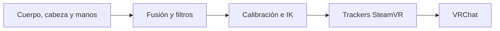

# Cam2VR

Cam2VR es un proyecto experimental para convertir el movimiento capturado por una webcam en datos de seguimiento corporal utilizables en realidad virtual y, finalmente, en VRChat.

El procesamiento está pensado para ejecutarse **completamente en local**, con baja latencia y enfocado en Windows. Python se utiliza para la detección y el procesamiento, mientras que C++ se encarga de la captura eficiente de la cámara.

> [!IMPORTANT]
> Cam2VR todavía está en desarrollo. Actualmente captura la webcam y detecta la pose corporal en tiempo real, pero aún no crea trackers virtuales ni envía movimiento a SteamVR o VRChat.

## Estado actual

### Implementado

- Captura nativa de webcam en Windows mediante Media Foundation.
- Decodificación de vídeo MJPEG mediante TurboJPEG.
- Módulo nativo de Python creado con pybind11.
- Buffer de baja latencia que conserva únicamente el frame más reciente.
- Frames RGB como arrays NumPy `uint8`.
- Detección corporal con MediaPipe Pose Landmarker.
- Extracción de 33 puntos corporales en 2D y 3D.
- Representación interna independiente de MediaPipe mediante `FullPose` y `Point`.
- Visualización del esqueleto sobre la imagen de la cámara.
- Métricas de FPS, inferencia, frames omitidos y detecciones inválidas.

### Pendiente

- Seguimiento preciso de la cabeza con posición y rotación.
- Seguimiento de manos, palmas y dedos.
- Filtrado, suavizado y recuperación de puntos perdidos.
- Calibración del usuario, cámara, suelo y escala.
- Conversión al sistema de coordenadas de realidad virtual.
- Cinemática inversa y restricciones anatómicas.
- Driver o trackers virtuales para SteamVR.
- Integración y pruebas dentro de VRChat.
- Interfaz y empaquetado final para Windows.

## Pipeline actual


La arquitectura futura continuará desde `FullPose`:



## Tecnologías

| Área | Tecnología |
|---|---|
| Captura de cámara | C++ y Windows Media Foundation |
| Decodificación MJPEG | TurboJPEG |
| Enlace C++/Python | pybind11 |
| Imágenes y arrays | NumPy |
| Detección corporal | MediaPipe Pose Landmarker |
| Ventana y visualización | OpenCV |
| Plataforma principal | Windows 10/11 de 64 bits |

## Estructura del proyecto

```text
Cam2VR/
├── cam2vr/
│   ├── hskcamera/
│   │   ├── cpp/
│   │   │   └── Camera.cpp
│   │   ├── hskcamera.pyd
│   │   ├── turbojpeg.dll
│   │   └── README.md
│   ├── models/
│   │   └── pose_landmarker_full.task
│   ├── pose/
│   │   ├── full_pose.py
│   │   └── mediapipe_pose.py
│   └── visualization/
│       └── pose_overlay.py
├── tests/
│   ├── test_frame_capture.py
│   ├── test_pose_image.py
│   └── test_show_capture.py
├── test_pose_capture.py
├── requirements.txt
├── LICENSE
└── README.md
```

## Requisitos

- Windows 10 u 11 de 64 bits.
- Python de 64 bits compatible con el archivo `hskcamera.pyd` incluido.
- Una webcam compatible con Media Foundation, preferiblemente con salida MJPEG.
- Los archivos `hskcamera.pyd` y `turbojpeg.dll` incluidos en `cam2vr/hskcamera/`.

El módulo nativo incluido está compilado para una versión concreta de Python. Si aparece un error al importarlo, puede ser necesario utilizar la misma versión de Python con la que fue compilado o reconstruir el módulo.

## Instalación

Clona el repositorio y cambia a la rama de desarrollo:

```powershell
git clone https://github.com/Hoshikuu/Cam2VR.git
cd Cam2VR
git switch dev
```

Crea y activa un entorno virtual:

```powershell
py -m venv .venv
.\.venv\Scripts\Activate.ps1
```

Instala las dependencias:

```powershell
python -m pip install --upgrade pip
python -m pip install -r requirements.txt
```

## Configuración de la cámara

Antes de ejecutar la prueba principal, revisa estas constantes en `test_pose_capture.py`:

```python
CAMERA_INDEX = 0
FORMAT_INDEX = 312
EXPOSURE = -6
```

- `CAMERA_INDEX` selecciona la webcam.
- `FORMAT_INDEX` selecciona uno de los formatos que expone su controlador.
- `EXPOSURE` establece una exposición manual.

El formato `312` es solamente un ejemplo usado durante el desarrollo y puede no existir en otra cámara u ordenador. Para consultar los formatos disponibles, activa temporalmente `list_formats=True` en una llamada a `camera.open(...)`.

## Ejecutar la pipeline corporal

Desde la raíz del repositorio:

```powershell
python .\test_pose_capture.py
```

La ventana mostrará:

- La imagen de la webcam.
- Los puntos y conexiones del cuerpo.
- FPS de cámara y del detector.
- Tiempo actual, promedio y P95 de inferencia.
- Número de secuencia y frames omitidos.
- Porcentaje de detecciones inválidas.

Pulsa `Q` o `Esc` para cerrar y liberar los recursos.

## Pruebas manuales

Capturar y mostrar información de varios frames:

```powershell
python .\tests\test_frame_capture.py
```

Mostrar la cámara en tiempo real sin ejecutar MediaPipe:

```powershell
python .\tests\test_show_capture.py
```

`tests/test_pose_image.py` todavía es una prueba experimental y necesita ser actualizada antes de poder ejecutarse con la API actual.

## Funcionamiento de baja latencia

`hskcamera` no crea una cola con todos los frames. Mantiene únicamente el más reciente:

```text
La cámara captura:       100 → 101 → 102 → 103
Python procesa:          100 ─────────────→
Siguiente frame recibido:                 103
```

Los frames `101` y `102` se omiten intencionadamente. Para seguimiento en tiempo real es preferible procesar una imagen reciente que acumular imágenes antiguas y aumentar progresivamente la latencia.

La llamada principal es:

```python
result = camera.wait_for_next_frame(
    last_sequence,
    timeout_ms=1000,
)
```

Cuando llega un frame devuelve:

```python
frame_rgb, sequence, capture_timestamp = result
```

El frame tiene este formato:

```text
Color: RGB
Tipo: uint8
Forma: (altura, anchura, 3)
```

## Resultado de la pose

MediaPipe se encapsula para que el resto del proyecto no dependa directamente de sus clases internas.

Cada punto corporal se convierte a:

```python
Point(
    x=...,
    y=...,
    z=...,
    visibility=...,
    presence=...,
)
```

El resultado completo de un frame se guarda como:

```python
FullPose(
    sequence=...,
    capture_timestamp=...,
    inference_start_timestamp=...,
    inference_end_timestamp=...,
    points_2d=[...],
    points_3d=[...],
    valid=True,
)
```

Esta separación permitirá cambiar el detector o combinar cuerpo, cabeza y manos sin modificar toda la aplicación.

## Timestamps

El timestamp entregado actualmente por Media Foundation utiliza unidades de **100 nanosegundos**. MediaPipe Pose Landmarker en modo `VIDEO` necesita milisegundos:

```python
timestamp_ms = capture_timestamp_100ns // 10_000
```

Para garantizar que cada timestamp sea estrictamente creciente:

```python
timestamp_ms = max(
    capture_timestamp_100ns // 10_000,
    previous_timestamp_ms + 1,
)
```

Para convertir el mismo valor a segundos:

```python
timestamp_seconds = capture_timestamp_100ns / 10_000_000
```

## Limitaciones conocidas

- Los índices de cámara, formato y exposición todavía están escritos directamente en los scripts.
- `hskcamera.pyd` es un binario precompilado y todavía no existe un proceso de compilación reproducible dentro del repositorio.
- Las pruebas actuales son principalmente manuales y no forman todavía una suite de `pytest`.
- La estimación 3D de una sola webcam tiene profundidad relativa y necesita calibración.
- La pipeline corporal aún necesita correcciones y validación prolongada antes de añadir salida VR.
- No existe todavía comunicación con SteamVR ni VRChat.

## Hoja de ruta

- [x] Captura nativa de webcam.
- [x] Conversión MJPEG a RGB.
- [x] Integración del módulo C++ con Python.
- [x] Detección corporal 2D/3D.
- [x] Visualización y métricas básicas.
- [ ] Corregir y validar timestamps, visibilidad y pruebas actuales.
- [ ] Añadir seguimiento preciso de cabeza.
- [ ] Añadir seguimiento de manos.
- [ ] Fusionar y filtrar las observaciones.
- [ ] Crear un sistema de calibración.
- [ ] Convertir la pose a objetivos y coordenadas VR.
- [ ] Crear trackers virtuales para SteamVR.
- [ ] Integrar y validar el movimiento en VRChat.
- [ ] Crear interfaz, perfiles y empaquetado para Windows.

## Licencia

Cam2VR se distribuye bajo la licencia [MIT](LICENSE).

## Aviso

Este proyecto no está afiliado con VRChat, Valve, SteamVR, Google ni MediaPipe. Los nombres y marcas pertenecen a sus respectivos propietarios.